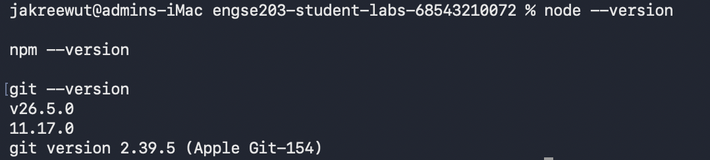
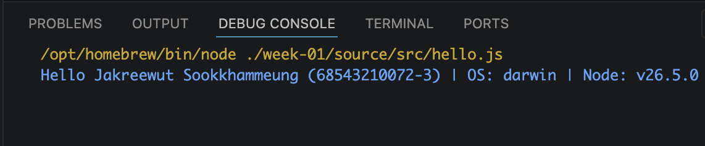

# Week 01 Evidence

ใส่ screenshots, test output หรือ reflection ที่ไม่ใช่ข้อมูลลับ แล้วอ้างชื่อไฟล์ใน `../README.md`

# Week 01 Evidence

## 1. Tool Versions Output

## 2. Hello.js Execution Result

## 3. Reflection
ในแล็บนี้ได้เรียนรู้วิธีการตั้งค่าสภาพแวดล้อมสำหรับการพัฒนา (Developer Environment) รวมถึงการใช้งาน Git workflow พื้นฐาน เช่น การ Clone โปรเจกต์, การสร้าง Branch แยกเพื่อย้าย Source Code และการจัดการไฟล์โครงสร้างผ่านคำสั่ง npm ครับ